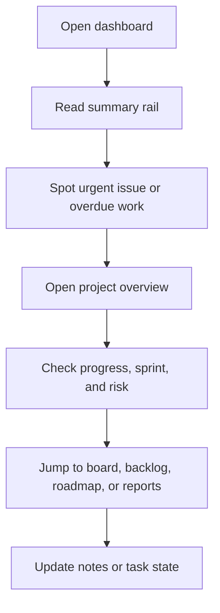

# UI/UX Benchmark Audit

## Scope
Reviewed official product and support pages from Asana, Jira, ClickUp, and monday.com to identify patterns worth applying to MediaSci Operation Hub.

## What The Best Products Do Well

- They start with a clear summary layer before deeper detail.
- They surface blockers, overdue work, and current focus early.
- They separate planning views from execution views.
- They use compact visual hierarchy, not dense walls of information.
- They make dashboards feel like a control room, not a report dump.
- They keep timelines, dependencies, and ownership visible together.
- They support stakeholder-friendly sharing with clean summaries and read-only views.

## Research Insights

### Asana
- Emphasizes visibility, blockers, and productivity in one shared hub.
- Uses project views and custom fields to keep performance readable without overwhelming the page.
- Good model for a calm overview page with a concise action area.

### Jira / Atlassian
- Roadmaps are framed around now, next, and later.
- Separate the story for stakeholders from the execution detail for teams.
- Good model for progressive disclosure and stakeholder-friendly planning.

### ClickUp
- Gantt and dependency views are treated as active planning tools, not static charts.
- Strong focus on risk, critical path, blocked work, and rescheduling impact.
- Good model for surfacing schedule health and dependency awareness.

### monday.com
- Dashboards are built for instant clarity across multiple boards.
- Repeatedly emphasizes at-a-glance progress, bottlenecks, and resource visibility.
- Good model for a summary rail plus clear metrics cards.

## What We Applied To MediaSci Operation Hub

- Added a calmer shell with stronger focus states and a skip link.
- Reworked the dashboard into a hero, summary rail, and section cards.
- Reworked project overview into a summary-first layout with explicit progress context.
- Replaced dense card blocks with more scannable section shells and insight cards.
- Improved empty states so missing data reads as intentional instead of unfinished.

## Recommended Interaction Pattern

## Prioritized Next Steps

1. Add an in-context project health indicator that combines progress, overdue work, and active sprint status.
2. Convert more dense lists into reusable micro rows with consistent labels and action affordances.
3. Add richer empty states with a clear next action for projects, epics, and sprints.
4. Make all major pages share the same hero/summary/section rhythm.

## Sources

- [Asana Project Management](https://asana.com/features/project-management)
- [Atlassian Roadmaps](https://www.atlassian.com/software/jira/product-discovery/features/roadmaps)
- [ClickUp Gantt Chart View](https://clickup.com/features/gantt-chart-view)
- [ClickUp Gantt Help](https://help.clickup.com/hc/en-us/articles/6310249474967-Create-and-share-a-Gantt-view)
- [monday.com Dashboards](https://monday.com/w/dashboards)
- [monday.com Dashboard Guide](https://support.monday.com/hc/en-us/articles/26233702292114-Configure-your-Dashboard)
